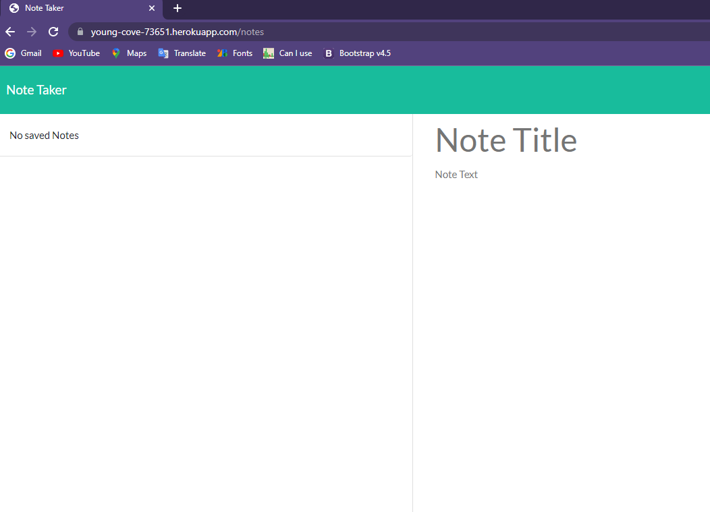

# 11 Express.js: Note Taker

## Description

An application for saving notes using Express and deployed to Heroku.

Saved notes have unique ids, and are able to be deleted.

They are stored to a file in the db folder.

## Acceptance Criteria

```
GIVEN a note-taking application
WHEN I open the Note Taker
THEN I am presented with a landing page with a link to a notes page
WHEN I click on the link to the notes page
THEN I am presented with a page with existing notes listed in the left-hand column, plus empty fields to enter a new note title and the note’s text in the right-hand column
WHEN I enter a new note title and the note’s text
THEN a Save icon appears in the navigation at the top of the page
WHEN I click on the Save icon
THEN the new note I have entered is saved and appears in the left-hand column with the other existing notes
WHEN I click on an existing note in the list in the left-hand column
THEN that note appears in the right-hand column
WHEN I click on the Write icon in the navigation at the top of the page
THEN I am presented with empty fields to enter a new note title and the note’s text in the right-hand column
```


## Screenshot




## Getting Started

Created server.js and routes folder for backend functionality

## Usage

run npm i then node server to run in terminal

or use in live Heroku link

## GitHub Link

[Github](https://github.com/klitun/Litun_Express_Note_Taker)

## Heroku Link

[Heroku](https://young-cove-73651.herokuapp.com/)